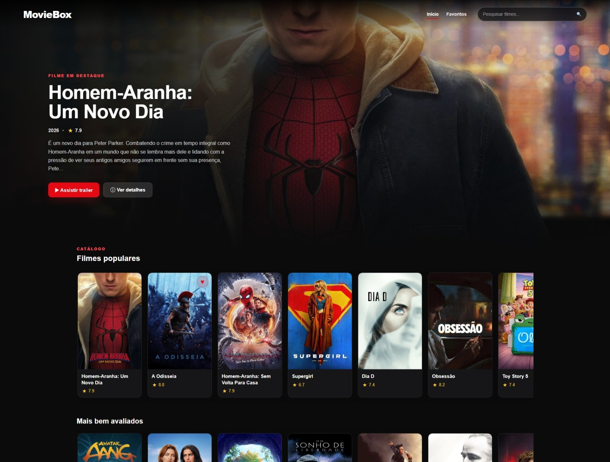
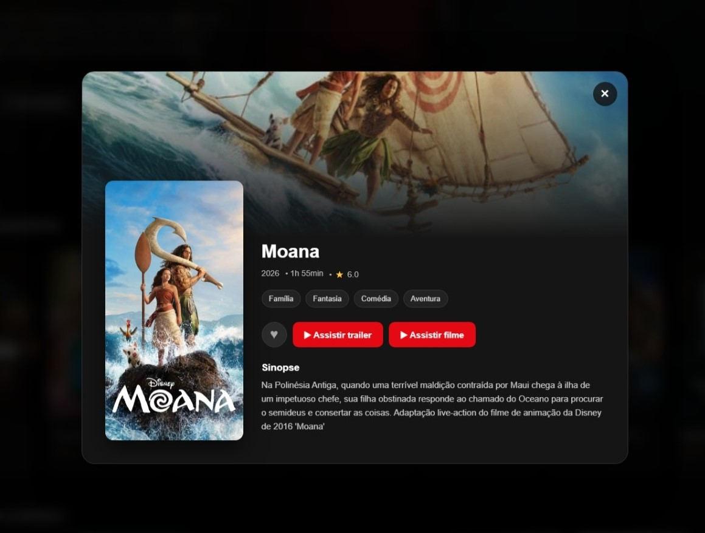
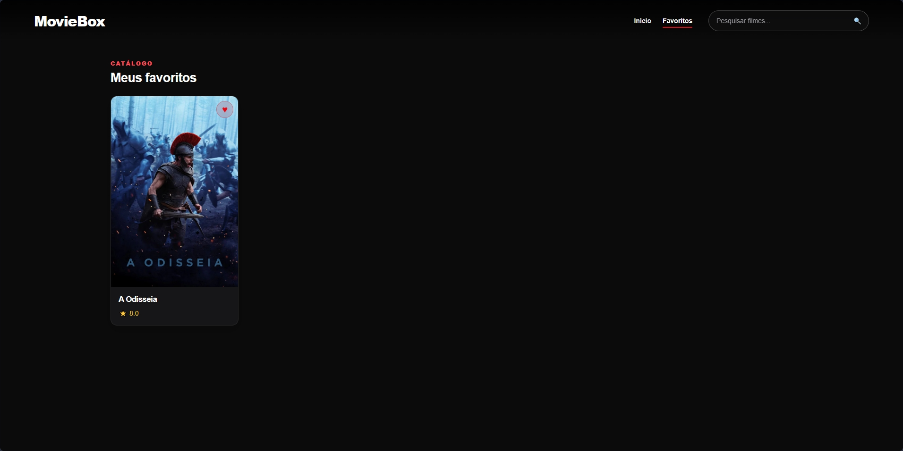

# 🎬 MovieBox

MovieBox é uma aplicação web de catálogo de filmes desenvolvida com **HTML, CSS e JavaScript puro**.

O projeto utiliza a API do **TMDB** para exibir filmes populares, mais bem avaliados, em cartaz e próximos lançamentos. Também possui pesquisa, favoritos, detalhes dos filmes e reprodução de trailers.

## ✨ Funcionalidades

- 🎥 Catálogo de filmes utilizando dados do TMDB
- 🔎 Pesquisa de filmes por título
- ❤️ Sistema de favoritos
- 💾 Favoritos salvos com LocalStorage
- 🎞️ Reprodução de trailers
- 📖 Modal com informações detalhadas dos filmes
- ⭐ Exibição de avaliações
- 🎭 Exibição de gêneros
- ⏱️ Duração dos filmes
- 🖼️ Filme em destaque na página inicial
- 🎬 Categorias organizadas em carrosséis
- ⏳ Skeleton loading durante o carregamento
- 📱 Layout responsivo para desktop e dispositivos móveis
- ♿ Atributos ARIA em elementos interativos

## 🖥️ Demonstração

### Página inicial

> 

### Detalhes do filme

> 

### Favoritos

> 

## 🛠️ Tecnologias utilizadas

- HTML5
- CSS3
- JavaScript
- TMDB API
- LocalStorage
- YouTube Embed

## 📂 Estrutura do projeto

```text
moviebox/
│
├── index.html
├── style.css
├── script.js
├── config.example.js
├── .gitignore
└── README.md
```

## 🔑 Configuração da API

O MovieBox utiliza a API do TMDB para buscar as informações dos filmes.

Por segurança, o arquivo com a chave real da API não é enviado para o GitHub.

Depois de clonar o projeto, crie um arquivo chamado:

```text
config.js
```

Utilize o arquivo `config.example.js` como modelo.

Exemplo:

```javascript
const API_KEY = "SUA_CHAVE_AQUI";
```

Substitua `SUA_CHAVE_AQUI` pela sua chave da API do TMDB.

## 🚀 Como executar o projeto

Clone este repositório:

```bash
git clone https://github.com/gg-ka/moviebox.git
```

Entre na pasta do projeto:

```bash
cd moviebox
```

O projeto deve ser executado através de um servidor local.

Uma opção simples é utilizar o `serve`:

```bash
npx serve .
```

Depois, abra no navegador o endereço informado no terminal.

## ❤️ Sistema de favoritos

Os filmes podem ser adicionados ou removidos dos favoritos através do botão de coração presente nos cards e na tela de detalhes.

Os favoritos são armazenados no `localStorage` do navegador, permitindo que continuem salvos mesmo depois que a página é recarregada.

O estado do coração também é sincronizado quando o mesmo filme aparece em diferentes categorias.

## 🔎 Pesquisa

A barra de pesquisa permite procurar filmes pelo título utilizando a API do TMDB.

Os resultados são exibidos em uma grade separada da página inicial.

## 🎬 Categorias

A página inicial organiza os filmes em diferentes categorias:

- Filmes populares
- Mais bem avaliados
- Em cartaz
- Próximos lançamentos

As categorias são exibidas através de carrosséis horizontais.

## 🎞️ Trailers

Os trailers disponíveis são encontrados através dos dados fornecidos pelo TMDB.

O MovieBox procura primeiro por um trailer oficial hospedado no YouTube. Caso não encontre, tenta utilizar outro trailer ou teaser disponível.

## 📖 Detalhes dos filmes

Ao clicar em um card, é aberto um modal contendo informações como:

- Título
- Ano de lançamento
- Duração
- Avaliação
- Gêneros
- Sinopse
- Pôster
- Imagem de fundo
- Trailer
- Opção de adicionar aos favoritos

## ⏳ Carregamento

Durante o carregamento das categorias da página inicial, o MovieBox utiliza **skeleton loading** para indicar visualmente que os dados estão sendo buscados.

Quando a resposta da API é recebida, os skeletons são substituídos pelos cards reais dos filmes.

## 📱 Responsividade

A interface foi desenvolvida para se adaptar a diferentes tamanhos de tela.

O layout possui ajustes para:

- Desktop
- Tablet
- Smartphones

Nos dispositivos móveis, os carrosséis podem ser navegados através do toque.

## 📚 O que pratiquei neste projeto

Durante o desenvolvimento do MovieBox, trabalhei conceitos como:

- Consumo de APIs REST
- Requisições com `fetch`
- `async` e `await`
- Manipulação do DOM
- Eventos em JavaScript
- Arrays e métodos como `filter`, `find` e `some`
- LocalStorage
- Template literals
- Tratamento de erros
- Manipulação de classes CSS
- Responsividade
- Componentes visuais criados dinamicamente com JavaScript
- Organização e reutilização de funções
- Noções básicas de acessibilidade

## 🌐 Deploy

> Link da aplicação será adicionado em breve.

## 📌 Status do projeto

✅ Funcional

O projeto está em uma versão estável, podendo receber novas melhorias futuramente.

## 📄 Licença

Projeto desenvolvido para fins de estudo e portfólio.

## 🎥 TMDB

Este produto utiliza a API do TMDB, mas não é endossado ou certificado pelo TMDB.